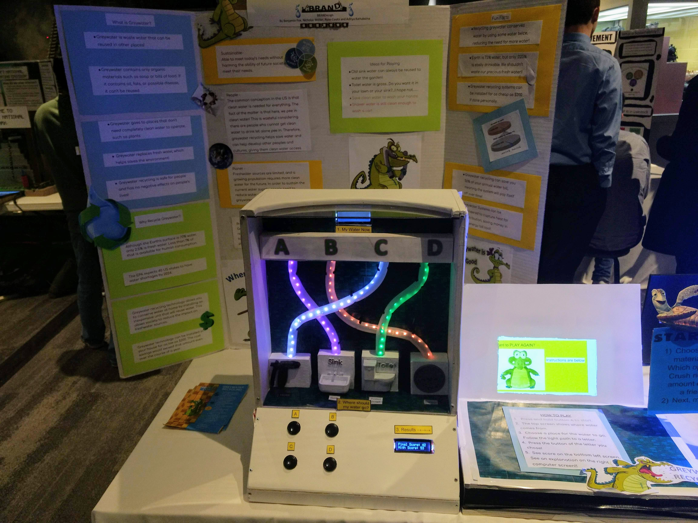
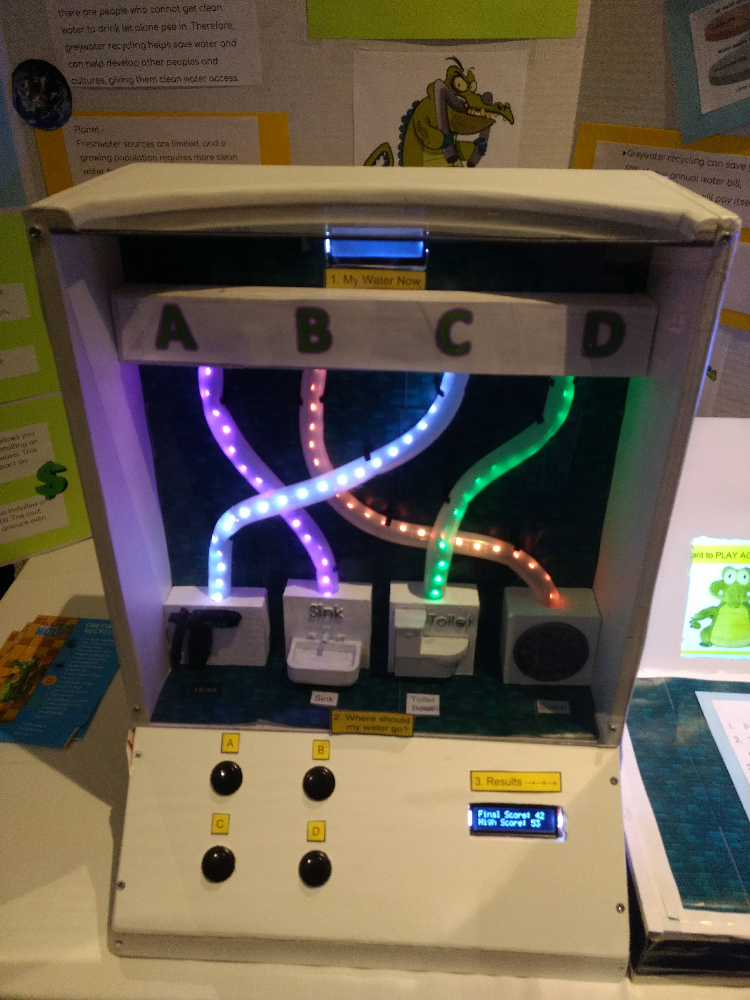

# Greywater-Recycling
Project for Cornerstone of Engineering course. Project served as temporary exhibit at Museum of Science in Boston, so theme and message had to be understood by younger children.

Game in which LCD screen cycles through sources of water from typical household. User chooses one of four potential destinations with specific buttons. When button is chosen, LED "flows" from LCD screen to chosen output. Depending on the environmental friendliness of the source-destination combination, a score is assigned. The score updates on another LCD screen, and an explanation is shown with a graphic on a laptop running MATLAB. After a number of rounds of the game, the game finishes with a final score showing on an LCD screen. The game automatically resets for the next user.

The respository has code for the two different Arduinos inside the project. One also connected to the laptop's MATLAB program, controlling it through a Serial USB connection. The final project is pictured below.

